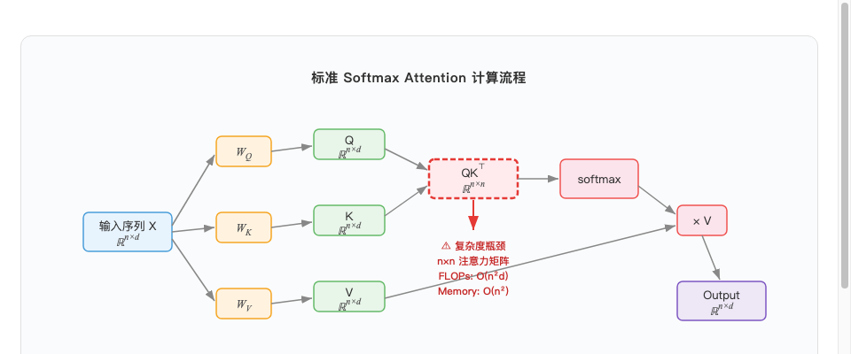
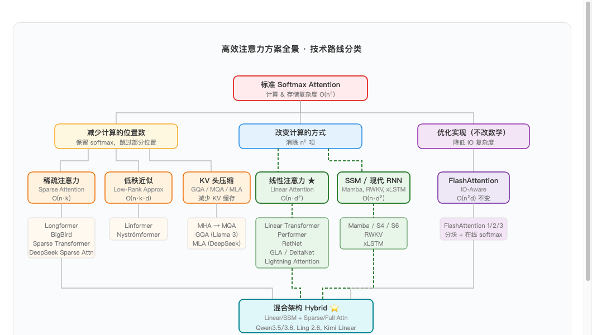
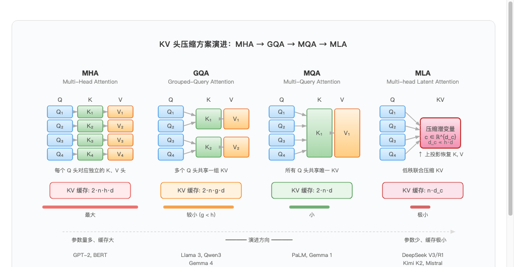
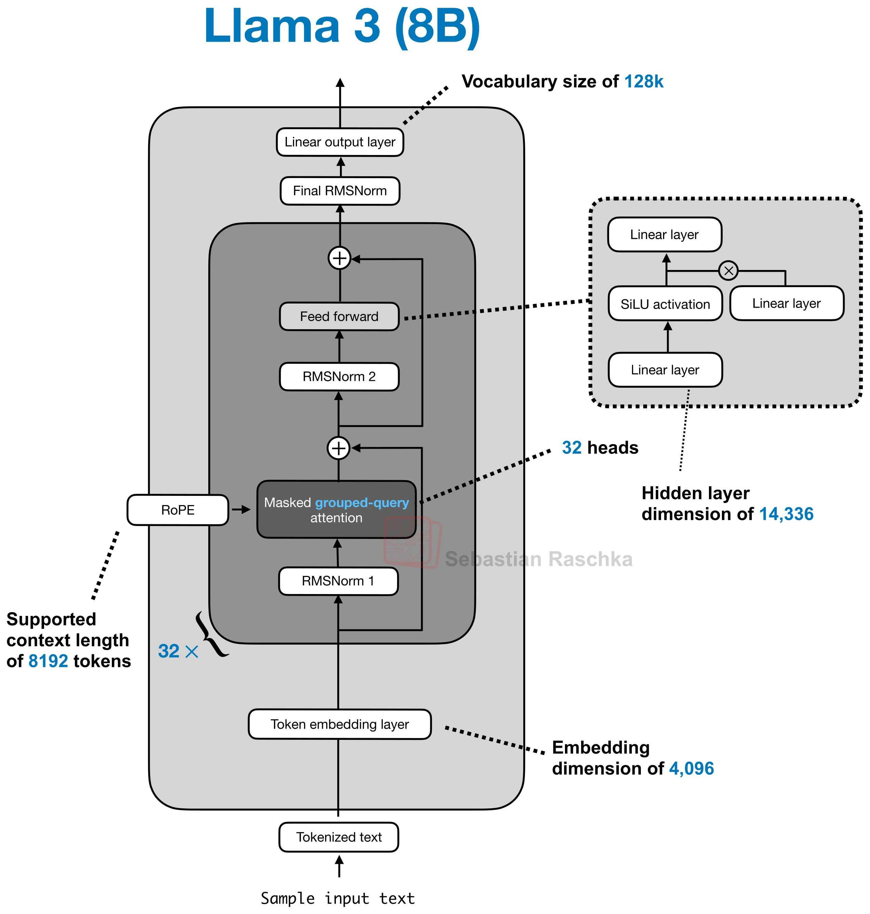
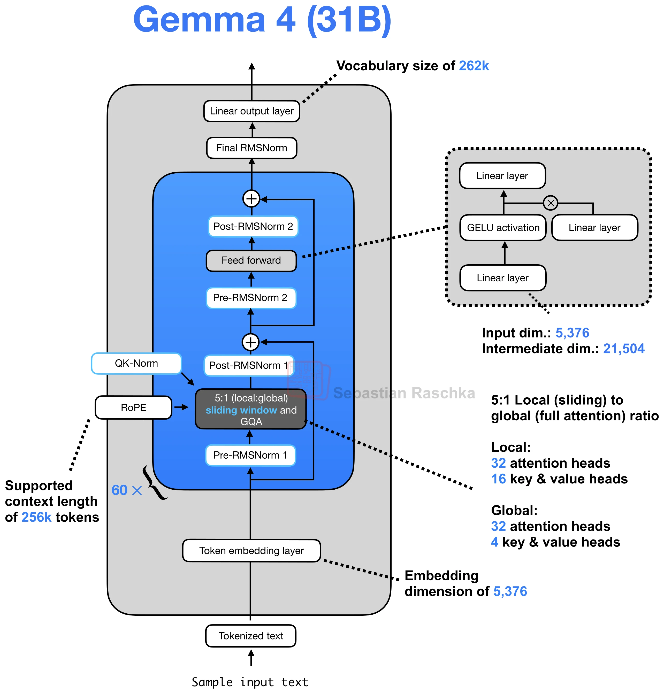
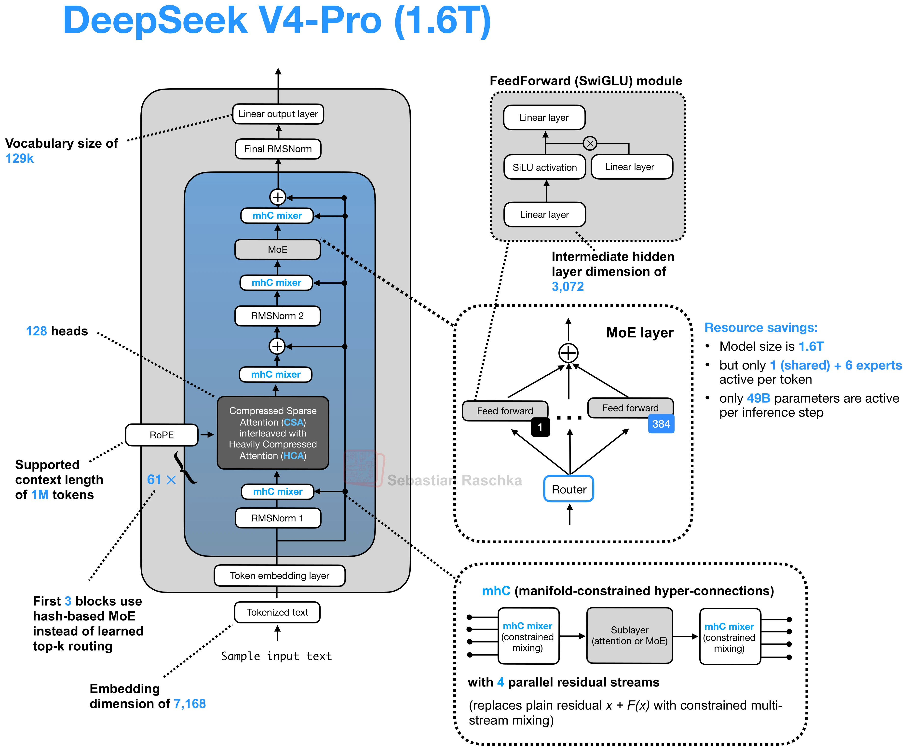
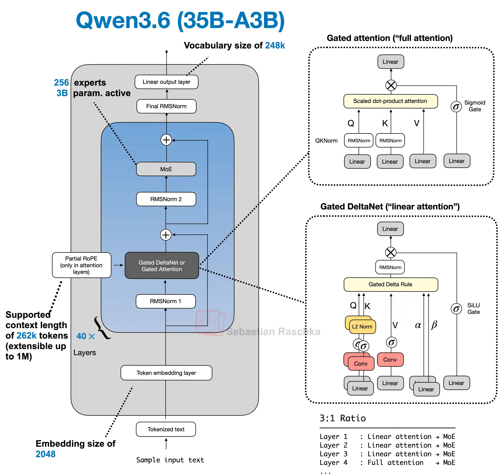
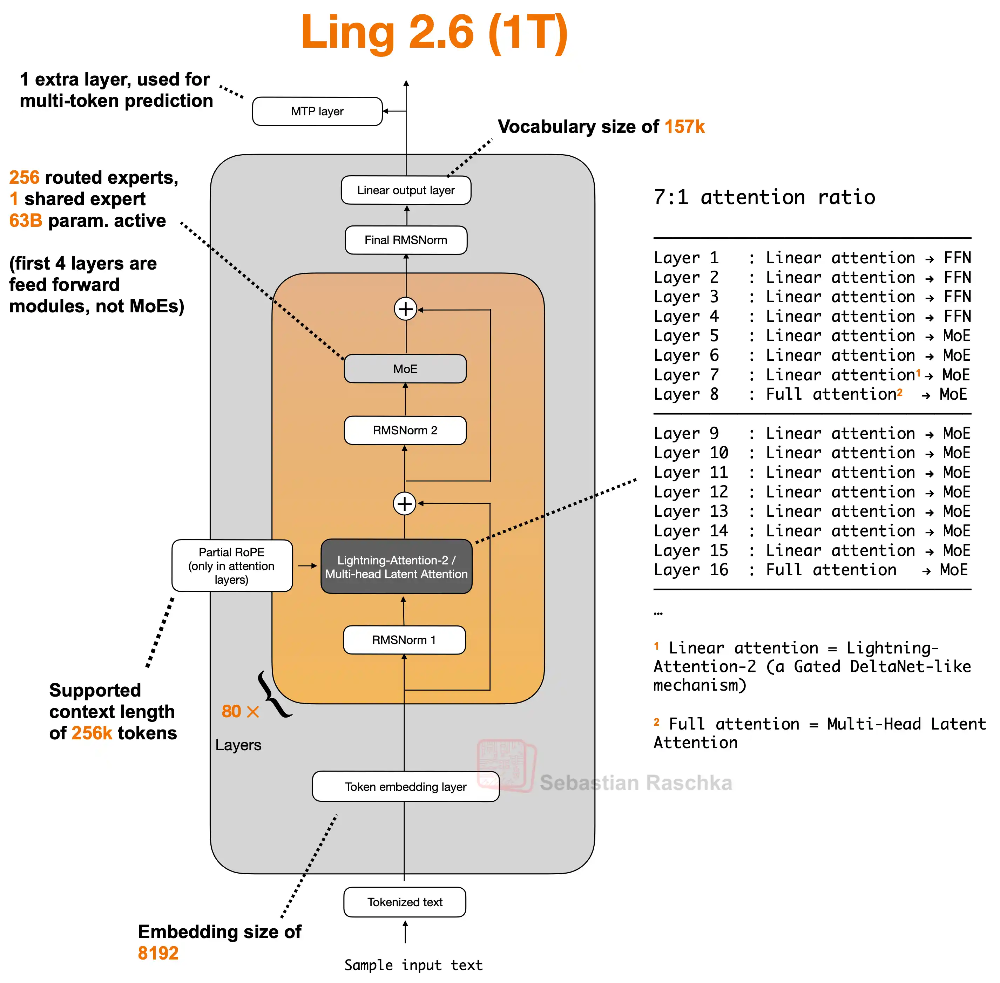

# 线性注意力（Linear Attention）深度解析


## 目录

1. [背景：标准 Attention 的复杂度瓶颈](#1-背景标准-attention-的复杂度瓶颈)
2. [高效注意力方案全景](#2-高效注意力方案全景)
3. [主流大模型的注意力方案选择](#3-主流大模型的注意力方案选择)
4. [线性注意力详解](#4-线性注意力详解)
5. [代码实战：Qwen3.5 的 Gated DeltaNet 实现](#5-代码实战qwen35-的-gated-deltanet-实现)
6. [线性注意力的优势与局限](#6-线性注意力的优势与局限)
7. [参考文献](#7-参考文献)

---

## 1. 背景：标准 Attention 的复杂度瓶颈

给定输入序列长度为 $n$，模型维度为 $d$，标准自注意力的计算过程如下：

$$
\text{Attention}(Q, K, V) = \text{softmax}\!\left(\frac{QK^\top}{\sqrt{d}}\right) V
$$

其中 $Q, K, V \in \mathbb{R}^{n \times d}$ 分别是查询、键、值矩阵。



因此，标准自注意力的计算复杂度和空间复杂度都是O(n²)
- 计算复杂度（FLOPs）
     - $QK^\top$：两个 $n \times d$ 矩阵相乘，浮点运算量为 $O(n^2 d)$
     - $\text{softmax}(\cdot) \times V$：$n \times n$ 矩阵与 $n \times d$ 矩阵相乘，浮点运算量同为 $O(n^2 d)$
     - 总计算复杂度：$O(n^2 d)$
- 空间复杂度
     - 注意力矩阵 $A = \text{softmax}(QK^\top / \sqrt{d})$ 的形状为 $n \times n$
     - 需要存储完整的注意力矩阵以完成反向传播（计算梯度）
     - 空间复杂度：$O(n^2)$（与 $d$ 无关）

目前的LLM追求越来越长的上下文，因此会受到计算复杂度和空间复杂度的双重限制，空间复杂度的解决方案有FlashAttention（IO复杂度），计算复杂度的解决方案有稀疏注意力、线性注意力等。


## 2. 高效注意力方案全景

面对 $O(n^2)$ 的瓶颈，研究者们提出了多条不同的技术路线：



### 2.1 稀疏注意力（Sparse Attention）

**核心思路**：$n \times n$ 的注意力矩阵中大部分值接近 0，不如只计算其中一部分。

早期的稀疏注意力使用**预定义的固定模式**：

| 方法 | 稀疏模式 | 复杂度 |
|------|---------|--------|
| Sparse Transformer (Child et al., 2019) | Strided + 固定模式 | $O(n\sqrt{n})$ |
| Longformer (Beltagy et al., 2020) | 滑动窗口 + 全局 token | $O(n \cdot w)$，$w$ 为窗口大小 |
| BigBird (Zaheer et al., 2020) | 滑动窗口 + 全局 + 随机 | $O(n \cdot w)$ |

固定模式的缺点是可能遗漏重要的远距离依赖。DeepSeek 提出了**数据驱动的动态稀疏注意力**（DSA），根据实际的注意力分布来决定哪些位置需要计算：

- **DeepSeek Sparse Attention (DSA)**（DeepSeek V3.2, 2025）：将上下文划分为固定大小的块（block），先用低成本的方式估算每个块的重要性分数，只对高分块计算完整注意力。具体包含三种组件：
  - **Sliding Window**：局部窗口内的 token 始终参与计算，捕获近距离依赖
  - **Block Selection**：对远距离的块计算粗粒度注意力分数，动态选择 top-k 个重要块进行精确计算
  - **Global Tokens**：少量全局 token（如句首、段落边界）始终可见，保证关键信息不丢失

DSA 已被 DeepSeek V3.2、V4-Pro/Flash、GLM-5/5.1 等模型采用，是目前工业界最成功的稀疏注意力方案之一。

**优点**：保留 softmax，数据驱动的稀疏模式自适应性强

**缺点**：块选择引入额外开销，实现复杂度高于固定模式

### 2.2 低秩近似（Low-Rank Approximation）

**核心思路**：注意力矩阵天然是低秩的，用投影将序列长度 $n$ 压缩到 $k$。

- **Linformer** (Wang et al., 2020)：用投影矩阵 $E, F \in \mathbb{R}^{k \times n}$ 将 $K, V$ 从 $n \times d$ 压缩到 $k \times d$：

$$
\text{LinformerAttn}(Q, K, V) = \text{softmax}\!\left(\frac{Q(EK)^\top}{\sqrt{d}}\right) FV
$$

- 复杂度从 $O(n^2 d)$ 降到 $O(nkd)$

### 2.3 KV 头压缩（MHA → MQA → GQA → MLA）

**核心思路**：不改变注意力的计算方式，而是减少 KV 缓存的大小。



- **GQA** (Ainslie et al., 2023)：目前最主流，被 Llama 3、Qwen3、Gemma 等广泛采用
- **MLA** (DeepSeek, 2024)：通过低秩联合压缩进一步减小 KV 缓存，被 DeepSeek V3/R1、Kimi K2、Mistral 等采用

### 2.4 状态空间模型 / 现代 RNN（SSM / Linear RNN）

**核心思路**：完全抛弃注意力矩阵，回归递推形式，用固定大小的隐状态处理序列。

$$
h_t = \bar{A} h_{t-1} + \bar{B} x_t, \quad y_t = C h_t
$$

- **Mamba / S4 / S6**：用结构化状态空间方程做序列建模，复杂度 $O(n)$
- **xLSTM**：扩展 LSTM，用矩阵记忆替代标量记忆
- **RWKV**：本质是带时间衰减的线性注意力，可以展开为 RNN 递推形式

> 与你 repo 中的 RNN/LSTM/GRU 实现有直系血缘关系——可以理解为"用现代方法重新做 RNN"。

### 2.5 IO 感知优化（FlashAttention）

**核心思路**：不改变数学公式，通过优化 GPU 内存访问模式大幅提速。

- **FlashAttention** (Dao et al., 2022)：分块计算注意力，将 softmax 的在线归一化（online softmax）放在 SRAM 中完成，避免将 $n \times n$ 矩阵写入 HBM
- 数学上**完全等价**于标准 attention，但速度快 2-4 倍，显存降一个量级
- **FlashAttention-2/3**：进一步优化 warp 级并行和异步流水线

### 2.6 方案对比总表

| 方案 | 策略 | 保留 softmax | 计算复杂度 | 存储复杂度 | 代表方法 |
|------|------|:-----------:|-----------|-----------|---------|
| 稀疏注意力 | 减少计算位置 | ✅ | $O(n \cdot k)$ | $O(n \cdot k)$ | Longformer, BigBird |
| 低秩近似 | 压缩序列维度 | ✅ | $O(n \cdot k \cdot d)$ | $O(n \cdot k)$ | Linformer, Nyströmformer |
| **线性注意力** | 替换 softmax | ❌ | $O(n \cdot d^2)$ | $O(d^2)$ | Linear Transformer, Performer |
| SSM / RNN | 递推隐状态 | ❌ | $O(n \cdot d^2)$ | $O(d^2)$ | Mamba, RWKV, xLSTM |
| IO 优化 | 优化内存访问 | ✅ | $O(n^2 d)$（不变） | $O(n)$（分块） | FlashAttention |
| KV 头压缩 | 减少 KV 冗余 | ✅ | $O(n^2 d)$（不变） | KV 缓存大幅减小 | GQA, MQA, MLA |

---

## 3. 主流大模型的注意力方案选择

基于 [LLM Architecture Gallery](https://sebastianraschka.com/llm-architecture-gallery/)（Sebastian Raschka）的统计，截至 2026 年中，主流大模型的注意力方案沿着两条并行的技术路线发展：

### 3.1 基线方案：GQA + 滑动窗口 + FlashAttention

2024-2025 年间发布的大量模型采用这一组合，至今仍是许多模型的基础配置：

| 模型 | 注意力方案 | 窗口模式 |
|------|-----------|---------|
| Llama 3/3.2 (8B/70B) | GQA + RoPE | 全局 |
| Qwen3 (0.6B-235B) | GQA + QK-Norm | 全局 |
| Gemma 3/4 | GQA + QK-Norm | 5:1 滑动窗口/全局 |
| GPT-OSS (20B/120B) | GQA | 交替滑动窗口/全局 |
| OLMo 3 | MHA/GQA + QK-Norm | 3:1 滑动窗口/全局 |

其中滑动窗口 + 全局层的**层间混合**（如 Gemma 的 5:1、GPT-OSS 的交替模式）已成为标配，本质是一种稀疏注意力与全注意力的混合。

**典型架构示例：**

| Llama 3 (8B) — 纯 GQA 全局注意力基线 | Gemma 4 (31B) — 5:1 滑动窗口/全局混合 |
|:---:|:---:|
|  |  |

> 图片来源：[LLM Architecture Gallery](https://sebastianraschka.com/llm-architecture-gallery/)（Sebastian Raschka）

### 3.2 路线 A：压缩 + 稀疏（MLA → CSA/HCA）

这条路线的核心思想是**不改变 softmax attention 本身，而是压缩 KV 缓存、减少参与计算的 KV 数量**。由 DeepSeek 主导推动，被多家跟进：

**阶段一：MLA**（2024-2025）

DeepSeek V2 提出 Multi-head Latent Attention，通过低秩联合压缩大幅降低 KV 缓存：

| 模型 | 发布时间 | 注意力 |
|------|:-------:|--------|
| DeepSeek V3/R1 | 2024.12 / 2025.01 | MLA |
| Kimi K2/K2.5/K2.6 | 2025.07-2026.04 | MLA |
| Mistral Large 3 / Small 4 | 2025-2026 | MLA |
| GLM-5/5.1 | 2026.02 / 2026.04 | MLA + DSA |

**阶段二：CSA/HCA**（2026）

DeepSeek V4 进一步演进，不再使用统一的 MLA 层，而是两种不同压缩策略的层**交替排列**：

| 模型 | 发布时间 | 注意力 |
|------|:-------:|--------|
| DeepSeek V4-Pro (1.6T) | 2026.04 | CSA/HCA 混合 |
| DeepSeek V4-Flash (284B) | 2026.04 | CSA/HCA 混合 |

注意：与 MLA 的压缩方式不同，MLA 压缩的是**每个 token 的 KV 表示**（per-token latent），而 CSA/HCA 压缩的是**序列长度维度**——将一组 token 合并为更少的 KV entry，从而缩短缓存长度。

- **CSA（Compressed Sparse Attention）**：低压缩率（每 $m=4$ 个 token 压成 1 个 KV entry），压缩后再用 DSA top-k 选择重要块做稀疏注意力。精度高，用于精确回忆。
- **HCA（Heavily Compressed Attention）**：高压缩率（每 $m'=128$ 个 token 压成 1 个），不做稀疏选择，直接对所有压缩后 KV 做全注意力。缓存极小，用于粗粒度全局感知。
- 两者都额外带一个 **128-token 滑动窗口分支**捕获局部细节。
- CSA 和 HCA 互补：CSA 保留更多细节但只稀疏选择部分块，HCA 保留极少条目但能密集关注全局，因此 DeepSeek V4 选择**逐层交替排列**而非只用其中一种。

**具体交替方式**（来自模型 `config.json` 中的 `compress_rates` 字段）：

```
V4-Pro (61 层):
  Layer 0-1:  HCA, HCA           ← 最底层用 HCA 做粗粒度全局感知
  Layer 2-59: CSA, HCA 交替 ×29  ← 核心层严格 CSA/HCA 一一交替
  Layer 60:   CSA                ← 倒数第二层
  Layer 61:   Sliding Attention  ← 最后 1 层仅滑动窗口，不做压缩
  统计：31 HCA + 30 CSA + 1 Sliding = 62 (含 MTP 层)

V4-Flash (43 层):
  Layer 0-1:  Sliding, Sliding   ← 最底层仅滑动窗口
  Layer 2-41: CSA, HCA 交替 ×20  ← 核心层严格 CSA/HCA 一一交替
  Layer 42:   CSA                ← 倒数第二层
  Layer 43:   Sliding Attention  ← 最后 1 层仅滑动窗口，不做压缩
  统计：20 HCA + 21 CSA + 3 Sliding = 44 (含 MTP 层)
```

在 1M token 上下文下，V4-Pro 相比 V3.2 只需 **27% 的 FLOPs** 和 **10% 的 KV 缓存**。

**典型架构示例：**



> 图片来源：[LLM Architecture Gallery](https://sebastianraschka.com/llm-architecture-gallery/)（Sebastian Raschka）

### 3.3 路线 B：线性注意力/SSM + 标准注意力混合

这条路线的核心思想是**用线性复杂度的层替代大部分 softmax attention 层，只保留少量标准注意力层做精确回忆**。由 Qwen、Ling、Kimi 等并行推进：

| 模型 | 发布时间 | 架构 | 层配比 |
|------|:-------:|------|--------|
| **Kimi Linear** (48B-A3B) | 2025.10 | Delta Attention + MLA | 20:7 (≈3:1) |
| **Nemotron 3 Nano** (30B) | 2025.12 | Mamba-2 + GQA | 23:6 (≈4:1) |
| **Qwen3.5** (397B) | 2026.02 | Gated DeltaNet + Gated Attn | 45:15 (3:1) |
| **Ling 2.5/2.6** (1T) | 2026.02 / 2026.04 | Lightning Attention + MLA | 70:10 (7:1) |
| **Qwen3.6** (35B-A3B) | 2026.04 | Gated DeltaNet + Gated Attn | 30:10 (3:1) |
| **Qwen3.6** (27B) | 2026.04 | Gated DeltaNet + Gated Attn | 48:16 (3:1) |

**典型架构示例：**

| Qwen3.6 (35B-A3B) — 3:1 Gated DeltaNet + Gated Attn | Ling 2.6 (1T) — 7:1 Lightning Attention + MLA |
|:---:|:---:|
|  |  |

> 图片来源：[LLM Architecture Gallery](https://sebastianraschka.com/llm-architecture-gallery/)（Sebastian Raschka）

> **两条路线并非互斥，而是可以叠加组合**：例如 Ling 2.6 的少量标准注意力层用的就是 MLA（路线 A），而大量层用 Lightning Attention（路线 B）；Kimi Linear 同样是 Delta Attention + MLA 的组合。未来可能还会出现 CSA/HCA + 线性注意力的进一步融合。

---

## 4. 线性注意力详解

> 本节内容参考了苏剑林的 [《线性注意力简史：从模仿、创新到反哺》](https://spaces.ac.cn/archives/11033) 以及 [知乎专栏](https://zhuanlan.zhihu.com/p/718156896) 的相关讨论。

### 4.1 最初的模样：去掉 exp

#### 从标准注意力出发

首先引入记号：$q_i, k_i, v_i, o_i \in \mathbb{R}^{d \times 1}$，将它们按行排列得到矩阵 $Q, K, V, O \in \mathbb{R}^{n \times d}$（为简化讨论，令 $Q, K, V$ 的维度相同，实际上 GAU、MLA 等允许 $Q, K$ 与 $V$ 维度不同，但不影响本质）。

标准的 Softmax Attention（省略缩放因子 $1/\sqrt{d}$，因为它总可以吸收到 $Q, K$ 中）为：

$$
O = \text{softmax}(QK^\top + \log M) V \tag{1}
$$

其中 $\text{softmax}$ 对第二个维度（即 Key 维度）做指数归一化，$M \in \mathbb{R}^{n \times n}$ 是下三角掩码矩阵：

$$
M_{ij} = \begin{cases} 1, & i \geq j \\ 0, & i < j \end{cases}
$$

$\log M$ 是对 $M$ 逐元素取对数，其中 $\log 0 = -\infty$。这样，$j > i$ 的位置加上 $-\infty$ 后经过 $\exp$ 变为 0，自然实现了 Causal Mask。写成分量形式：

$$
o_t = \frac{\sum_{j=1}^{t} \exp(q_t^\top k_j) \, v_j}{\sum_{j=1}^{t} \exp(q_t^\top k_j)} \tag{2}
$$

其中分母的作用主要是保持数值稳定性。但注意到，在现代 Transformer 架构中，注意力输出之后通常都会接一个归一化层（如 RMSNorm）。而 RMSNorm 对缩放不变：

$$
\text{RMSNorm}(\alpha \cdot x) = \text{RMSNorm}(x), \quad \forall \alpha > 0
$$

式 (2) 的分母对每个位置 $t$ 而言只是一个正的标量，它把整个输出向量 $o_t$ 等比缩放。而 RMSNorm 恰好消除等比缩放，所以**分母经过 RMSNorm 后被自动抵消了**。换句话说，Softmax Attention 的核心是分子部分：

$$
O = \exp(QK^\top + \log M) \, V = (\exp(QK^\top) \odot M) \, V \tag{3}
$$

其中 $\odot$ 是 Hadamard 积（逐元素乘法），$\exp$ 是逐元素取指数。

#### 去掉 exp：线性注意力的核心思想

线性注意力最初的思路非常简单——**直接去掉 $\exp$**：

$$
O = (QK^\top \odot M) V \tag{4}
$$

为什么这就是"线性"的？先看非 Causal 版本（去掉 $\odot M$）：

$$
O = (QK^\top)V = Q(K^\top V)
$$

注意括号的位置：先算 $K^\top V$（$d \times d$ 矩阵，复杂度 $O(nd^2)$），再乘 $Q$（复杂度 $O(nd^2)$），总复杂度**关于 $n$ 是线性的**。


#### Causal 版本与 RNN 形式

对于 Causal 场景，写成分量形式：

$$
o_t = \sum_{j=1}^{t} v_j (k_j^\top q_t) = \left(\sum_{j=1}^{t} v_j k_j^\top\right) q_t \tag{5}
$$

记括号部分为 $S_t$，则：

$$
o_t = S_t q_t, \quad S_t = S_{t-1} + v_t k_t^\top \tag{6}
$$

这就是一个以 $S_t$ ($d \times d$ 矩阵) 为隐状态的**线性 RNN**。推理时每步只需更新固定大小的 $S$ 矩阵，每一步的复杂度是常数，总的复杂度正比于序列长度 $n$。

#### 早期变体：特征映射

早期的线性注意力还保留着明显的"模仿 Softmax"痕迹：

- **Performer** (2021)：用随机特征映射 $\phi$ 近似 $\exp(q^\top k) \approx \phi(q)^\top \phi(k)$，追求与 Softmax 的无偏近似
- **Linear Transformer** (2020)：用 $\phi(x) = \text{elu}(x) + 1$ 作为特征映射，并保留分母归一化

早期之所以要加 $\phi$，是因为保留了分母归一化：分母 $\sum_j \phi(k_j)^\top \phi(q_t)$ 要求每项非负才能保证分母为正、不会除以零或负数（在 Softmax 中 $\exp(\cdot) > 0$ 天然保证了这一点）。但正如前面所述，既然最终用 RMSNorm 做事后归一化就够了，分母本身就不需要了，非负性也就不是必须的了。现有的结果表明，**不加 $\phi$、直接用原始 $Q, K$ 已经足够好**。

> 不过，光去掉 $\exp$ 远不足以让线性注意力变好用——最初的线性注意力性能很差，后面 4.2~4.3 介绍的遗忘门、Delta Rule 等一系列改进才是让它真正具备竞争力的关键。

### 4.2 花式遗忘门：从 cumsum 到 data-dependent decay

#### 问题：cumsum 导致记忆模糊

从式 (6) 可以看出，最初的线性注意力本质上就是 **cumsum**——将所有历史信息等权叠加。当叠加的 token 足够多时，每个 token 的信息占比都变得极小，固定大小的 $S_t$ 矩阵甚至无法准确重建任意一个 token。直觉上说，**每个 token 的记忆都变得模糊不清**。

#### RetNet：固定衰减因子

RetNet (2023) 引入了遗忘效应来缓解这个问题：

$$
o_t = S_t q_t, \quad S_t = \gamma S_{t-1} + v_t k_t^\top \tag{7}
$$

其中 $\gamma \in (0, 1)$ 是固定的衰减系数。加入衰减后，模型倾向于遗忘更久远的历史信息，至少保证最近 token 的分辨率——符合语言模型的**就近原则（Recency Bias）**。

#### GLA：数据相关的门控

RetNet 的 $\gamma$ 是固定常数。将 $\gamma$ 推广为与输入相关的 $\gamma_t$，就形成了 **data-dependent decay**：

$$
S_t = \gamma_t \odot S_{t-1} + v_t k_t^\top \tag{8}
$$

其中 $\gamma_t$ 是学习到的门控矩阵。这跟 GRU、LSTM 的"遗忘门"非常相似，只不过为了保持线性性，**去掉了遗忘门对 State 的依赖**。

> 为什么偏爱线性 RNN？因为线性 RNN 基本都能找到某种方式**并行训练**——转化为 Prefix Sum 问题后做 Associative Scan，或者更高效地写成分块矩阵乘法（Chunk-wise）形式，充分利用 GPU。这使得线性注意力在训练和推理效率上都不逊色于 Softmax Attention。

### 4.3 在线学习视角：TTT 与 DeltaNet

#### 将序列建模视为在线学习

**TTT（Test Time Training）** 给线性注意力的设计提供了一个上层指导原则：将序列模型的构建视为在线学习（Online Learning）问题。

具体来说，把 $K, V$ 视为语料对 $(k_1, v_1), (k_2, v_2), \ldots, (k_t, v_t)$，根据这些语料训练一个模型 $v = f(S_t; k)$，最后输出 $o_t = f(S_t; q_t)$。其中 $S_t$ 是模型参数。优化器（如 SGD）本质上就是关于模型参数的 RNN：

$$
o_t = f(S_t; q_t), \quad S_t = S_{t-1} - \eta_t \nabla_{S_{t-1}} \mathcal{L}(f(S_{t-1}; k_t), v_t) \tag{9}
$$

其中 $\mathcal{L}(f(S_{t-1}; k_t), v_t)$ 是当前数据 $(k_t, v_t)$ 在当前参数 $S_{t-1}$ 下的损失函数，$\eta_t$ 是学习率参数（参考上一节的 data-dependent decay，它也可以做成 data-dependent 的）。

这个框架可以覆盖非常多的 RNN 模型，比如式 (6) 的最初线性注意力和式 (7) 的 RetNet 都是它的特例：

| | 最初的线性注意力 (式 6) | RetNet (式 7) |
|---|---|---|
| **RNN** | $S_t = S_{t-1} + v_t k_t^\top$ | $S_t = \gamma S_{t-1} + v_t k_t^\top$ |
| **输出** | $o_t = S_t q_t$ | $o_t = S_t q_t$ |
| $f(S; k)$ | $Sk$ | $Sk$ |
| $\mathcal{L}(f(S;k), v)$ | $-v^\top(Sk)$ | $-v^\top(Sk) + \frac{1-\gamma}{2}\|S\|_F^2$ |
| $\eta_t$ | $1$ | $1$ |

可以看到，RetNet 的衰减因子 $\gamma$ 实际上对应于给损失函数加了一个 $\frac{1-\gamma}{2}\|S\|_F^2$ 的正则项（权重衰减）。TTT 原文则致力于探索 mini-batch 下的非线性 RNN，后来的 Titans 则给 TTT 的 SGD 加上了动量。

#### DeltaNet：除旧迎新

从表中可以看到，最初的线性注意力对应的损失函数是 $-v^\top(Sk)$，这是个无下界的目标，可能导致 $S$ 趋于无穷。更合理的目标是**平方损失** $\frac{1}{2}\|Sk - v\|^2$，即直接鼓励 $Sk = v$。将其代入 TTT 公式（式 9），取 $\eta_t = 1$：

$$
S_t = S_{t-1} - \underbrace{(S_{t-1}k_t - v_t)k_t^\top}_{\nabla_{S_{t-1}} \frac{1}{2}\|S_{t-1}k_t - v_t\|^2} \tag{10}
$$

展开后：

$$
S_t = S_{t-1}(I - k_t k_t^\top) + v_t k_t^\top \tag{11}
$$

对比最初的线性注意力式 (6)，DeltaNet 在加 $v_t k_t^\top$ 之前多减了一个 $(S_{t-1}k_t)k_t^\top$，其中 $S_{t-1}k_t$ 是新输入 $k_t$ 在旧模型 $S_{t-1}$ 下的预测结果。

直观理解：**先移除模型对 $k_t$ 的旧认知，再根据 $(k_t, v_t)$ 补充新认知**——"除旧迎新"。这个规则称为 **Delta Rule**（又称 Least Mean Square / Widrow-Hoff 算法），是上世纪 60 年代的产物。

#### Gated DeltaNet：DeltaNet + 遗忘门

Gated DeltaNet 进一步将遗忘门引入 DeltaNet：

$$
S_t = \alpha_t S_{t-1}(I - \beta_t k_t k_t^\top) + \beta_t v_t k_t^\top \tag{12}
$$

其中 $\alpha_t$ 是衰减因子（遗忘门），$\beta_t$ 是更新强度。等价形式：

$$
S_t = \gamma_t S_{t-1} + \eta_t(v_t - S_{t-1}k_t)k_t^\top \tag{13}
$$

即 $\gamma_t = \alpha_t, \eta_t = \alpha_t \beta_t$。这个形式更直观地保留了 Delta Rule 的 "除旧迎新" 语义，同时具备遗忘门的 Recency Bias。Gated DeltaNet 被 **Qwen3.5/3.6** 采用。

### 4.4 线性注意力的矩阵形式总览

将前面提到的各种线性注意力统一用矩阵形式写出：

| 模型 | 矩阵形式 |
|------|---------|
| Softmax Attention | $(\exp(QK^\top) \odot M) V$ |
| 最初的线性 Attention | $(QK^\top \odot M) V$ |
| + 遗忘门 (RetNet/GLA) | $(QK^\top \odot \Gamma) V$ |
| DeltaNet | $(QK^\top \odot M)(I + KK^\top \odot M^-)^{-1} V$ |
| Gated DeltaNet | $(QK^\top \odot \Gamma)(I + KK^\top \odot \Gamma^-)^{-1} V$ |

其中 $M$ 是因果掩码，$\Gamma$ 是衰减矩阵（$\Gamma_{i,j} = \prod_{\tau=j+1}^{i} \gamma_\tau$，$\Gamma_{i,i}=1$，$\Gamma_{i,j}=0$ 当 $i<j$），$M^- = M - I$，$\Gamma^- = \Gamma - I$。

前两行是直接从 RNN 公式展开的，下面推导后三种的矩阵形式。

#### 遗忘门的矩阵形式

从 RNN 形式 $S_t = \gamma_t S_{t-1} + v_t k_t^\top$（式 8）出发，递归展开：

$$S_t = \gamma_t(\gamma_{t-1} S_{t-2} + v_{t-1}k_{t-1}^\top) + v_t k_t^\top = \cdots = \sum_{j=1}^{t} \left(\prod_{\tau=j+1}^{t} \gamma_\tau\right) v_j k_j^\top = \sum_{j=1}^{t} \Gamma_{t,j} \, v_j k_j^\top$$

代入 $o_t = S_t q_t$：

$$o_t = \sum_{j=1}^{t} \Gamma_{t,j} (k_j^\top q_t) \, v_j$$

写成矩阵形式，就是 $(QK^\top \odot \Gamma) V$。可以看到 $\Gamma$ 同时承担了 Causal Mask（$i < j$ 时为 0）和距离衰减（越远越小）两个功能，替代了原来的二值掩码 $M$。

#### DeltaNet 的矩阵形式：求逆

DeltaNet 的 RNN 形式（式 11，取 $\eta_t = 1$）：

$$S_t = S_{t-1}(I - k_t k_t^\top) + v_t k_t^\top = S_{t-1} + (v_t - S_{t-1}k_t) k_t^\top$$

关键技巧：记 $u_t = v_t - S_{t-1}k_t$（"除旧"后的残差），则递归变回最初线性注意力的形式：

$$S_t = S_{t-1} + u_t k_t^\top$$

所以 DeltaNet 的输出和最初线性注意力一样，只是把 $V$ 换成了 $U = [u_1, u_2, \cdots, u_n]^\top$：

$$O = (QK^\top \odot M) \, U$$

剩下的问题是求 $U$。将 $S_{t-1} = \sum_{j=1}^{t-1} u_j k_j^\top$ 代入 $u_t$ 的定义：

$$u_t = v_t - \left(\sum_{j=1}^{t-1} u_j k_j^\top\right) k_t = v_t - \sum_{j=1}^{t-1} (k_j^\top k_t) \, u_j$$

写成矩阵形式（注意求和范围 $j < t$，即严格下三角）：

$$U = V - (KK^\top \odot M^-) \, U$$

其中 $M^- = M - I$ 是严格下三角矩阵（对角线为 0）。移项得：

$$(I + KK^\top \odot M^-) \, U = V \quad \Longrightarrow \quad U = (I + KK^\top \odot M^-)^{-1} V$$

代回输出公式，得到 DeltaNet 的矩阵形式：

$$O = (QK^\top \odot M)(I + KK^\top \odot M^-)^{-1} V$$

> 这里出现了 $n \times n$ 矩阵的逆，标准复杂度 $O(n^3)$，比 Softmax Attention 还高！但好在我们不需要显式求逆，只需解方程 $(I + B)U = V$，且 $I + B$ 是下三角阵、$B$ 具有低秩结构，可以写成分块矩阵乘法（Chunk-wise）形式，充分利用 GPU，将复杂度降到线性。

#### Gated DeltaNet 的矩阵形式

Gated DeltaNet（式 12）可以通过变量替换化归为 DeltaNet。定义 $\bar{\alpha}_t = \prod_{j=1}^{t} \alpha_j$，式 12 两边同除以 $\bar{\alpha}_t$：

$$\bar{\alpha}_t^{-1} S_t = \bar{\alpha}_{t-1}^{-1} S_{t-1} (I - \beta_t k_t k_t^\top) + \beta_t (\bar{\alpha}_t^{-1} v_t) k_t^\top$$

令 $\tilde{S}_t = \bar{\alpha}_t^{-1} S_t$，$\tilde{v}_t = \bar{\alpha}_t^{-1} v_t$，则 $\tilde{S}_t$ 满足 DeltaNet 的递归。又因为 $o_t = S_t q_t = \tilde{S}_t (\bar{\alpha}_t q_t)$，令 $\tilde{q}_t = \bar{\alpha}_t q_t$，就完全转化为 DeltaNet。

将重缩放后的 $\tilde{Q}, \tilde{V}$ 代入 DeltaNet 的矩阵形式，可以验证 $\bar{\alpha}$ 的因子恰好组合成衰减矩阵 $\Gamma$，最终得到：

$$O = (QK^\top \odot \Gamma)(I + KK^\top \odot \Gamma^-)^{-1} V$$

其中 $\Gamma^- = \Gamma - I$。


---

## 5. 代码实战：Qwen3.5 的 Gated DeltaNet 实现

以 Qwen3.5 为例，看看 Gated DeltaNet + Gated Attention 混合架构在 HuggingFace Transformers 中的实际实现。

> 代码来源：[huggingface/transformers](https://github.com/huggingface/transformers/tree/main/src/transformers/models/) 中的 `qwen3_5_moe`（modular 文件，定义 MoE 变体类名）、`qwen3_5`（GatedDeltaNet 实现）和 `qwen3_next`（Attention / MoE 基类）模块。

### 5.1 混合层的调度：config 中的 layer_types

Qwen3.5 的 `config.json` 通过 `layer_types` 字段显式指定每一层使用哪种注意力：

```python
# Qwen3.5-35B-A3B 的 layer_types（共 40 层，3:1 配比）
"layer_types": [
    "linear_attention", "linear_attention", "linear_attention", "full_attention",  # 层 0-3
    "linear_attention", "linear_attention", "linear_attention", "full_attention",  # 层 4-7
    "linear_attention", "linear_attention", "linear_attention", "full_attention",  # 层 8-11
    ...  # 以此类推，每 4 层中 3 层 linear + 1 层 full
]
```

在 `DecoderLayer.__init__` 中，根据 `layer_type` 选择实例化不同的注意力模块：

```python
class Qwen3_5MoeDecoderLayer(GradientCheckpointingLayer):
    def __init__(self, config, layer_idx):
        super().__init__()
        self.layer_type = config.layer_types[layer_idx]
        if self.layer_type == "linear_attention":
            self.linear_attn = Qwen3_5MoeGatedDeltaNet(config, layer_idx)
        elif self.layer_type == "full_attention":
            self.self_attn = Qwen3_5MoeAttention(config, layer_idx)
        self.mlp = Qwen3_5MoeSparseMoeBlock(config)
        self.input_layernorm = RMSNorm(config.hidden_size)
        self.post_attention_layernorm = RMSNorm(config.hidden_size)
```

前向传播时，`full_attention` 层接收 `position_embeddings`（RoPE）和 causal mask，而 `linear_attention` 层接收的是一个更简单的 padding mask——因为因果性已经内建在 RNN 递推中。

### 5.2 Gated DeltaNet 的 forward 流程

下面是 `Qwen3_5GatedDeltaNet.forward()` 的核心流程：

回顾 Gated DeltaNet 的 RNN 公式（式 12）：

$$S_t = \alpha_t S_{t-1}(I - \beta_t k_t k_t^\top) + \beta_t v_t k_t^\top, \quad o_t = S_t q_t$$

代码中每个步骤与公式的对应关系如下：

```python
# 1. 线性投影：从 hidden_states 中生成公式所需的 q_t, k_t, v_t, α_t, β_t
mixed_qkv = self.in_proj_qkv(hidden_states)   # → (b, n, 2*key_dim + value_dim)
z = self.in_proj_z(hidden_states)               # → (b, n, value_dim=4096) 门控归一化信号（不在公式中，用于输出归一化）
b = self.in_proj_b(hidden_states)               # → (b, n, num_v_heads=32) β_t 的输入，每个 V head 一个标量
a = self.in_proj_a(hidden_states)               # → (b, n, num_v_heads=32) α_t 的输入，每个 V head 一个标量

# 2. 因果卷积：为 QKV 加入短程局部信息（公式中没有，是工程上的增强）
#    kernel_size=4，让每个 token 的 q_t, k_t, v_t 融入前 3 个 token 的信息
mixed_qkv = causal_conv1d_fn(mixed_qkv, weight, bias, activation="silu")

# 3. 拆分得到公式中的 q_t, k_t, v_t
query, key, value = torch.split(mixed_qkv, [key_dim, key_dim, value_dim], dim=-1)

# 4. 计算公式中的 β_t 和 α_t
beta = b.sigmoid()                              # 式(12)中的 β_t ∈ (0, 1)
g = -A_log.exp() * softplus(a + dt_bias)        # g_t < 0，α_t = exp(g_t) ∈ (0, 1)
                                                 # 即式(12)中的衰减因子 α_t

# 5. 核心递推：实现式(12)的 S_t 更新和 o_t = S_t q_t
#    训练时：chunk_gated_delta_rule — 用4.4节推导的矩阵形式分块并行计算
#    推理时：recurrent_gated_delta_rule — 直接按式(12)逐步递推
core_attn_out, last_state = chunk_gated_delta_rule(
    query, key, value, g=g, beta=beta,           # 对应 q_t, k_t, v_t, α_t(对数域), β_t
    initial_state=recurrent_state,                # S_{t-1}：上一步的状态矩阵
    output_final_state=True,                      # 返回最终的 S_t 供下一步使用
)

# 6. 输出归一化：RMSNorm(o_t) * silu(z)（对应4.1节讨论的事后 RMSNorm）
core_attn_out = self.norm(core_attn_out, z)
output = self.out_proj(core_attn_out)
```

## 6. 线性注意力的优势与局限

### 6.1 优势

| 优势 | 说明 |
|------|------|
| **线性复杂度** | 计算和存储关于 $n$ 线性，支持百万级 token 上下文 |
| **常数推理代价** | 可展开为 RNN 递推，每步生成 token 的代价与序列长度无关 |
| **极小的 KV 缓存** | 只需维护 $d_v \times d_k$ 的隐状态矩阵 $S_t$（如 Qwen3.5 为 $128 \times 128$，每个 head），而非 $n \times d$ 的 KV 缓存 |
| **训练可并行** | 通过 chunk-wise 或 prefix-sum 方法保持训练并行性 |

### 6.2 局限

| 局限 | 说明 |
|------|------|
| **精确回忆能力弱** | 固定大小的隐状态不可避免地丢失信息，无法像标准 attention 那样精确回忆任意历史 token |
| **早期变体质量差** | 简单的 $\phi$ 选择（如 elu+1）在长距离依赖上效果明显不如 softmax |
| **训练不稳定** | 某些核函数可能导致数值不稳定（如归一化因子趋近 0） |
| **不适合所有任务** | 需要精确检索的任务（如复制、精确引用）仍需标准 attention |

---

## 7. 参考文献

### 核心论文

1. Vaswani et al. (2017). *Attention Is All You Need.* NeurIPS. [arXiv:1706.03762](https://arxiv.org/abs/1706.03762)
2. Katharopoulos et al. (2020). *Transformers are RNNs: Fast Autoregressive Transformers with Linear Attention.* ICML. [arXiv:2006.16236](https://arxiv.org/abs/2006.16236)
3. Choromanski et al. (2021). *Rethinking Attention with Performers.* ICLR. [arXiv:2009.14794](https://arxiv.org/abs/2009.14794)
4. Sun et al. (2023). *Retentive Network: A Successor to Transformer for Large Language Models.* [arXiv:2307.08621](https://arxiv.org/abs/2307.08621)
5. Yang et al. (2024). *Gated Linear Attention Transformers with Hardware-Efficient Training.* ICML. [arXiv:2312.06635](https://arxiv.org/abs/2312.06635)
6. Yang et al. (2024). *Parallelizing Linear Transformers with the Delta Rule over Sequence Length.* [arXiv:2406.06484](https://arxiv.org/abs/2406.06484)
7. Sun et al. (2024). *You Only Scan Once: Efficient Multi-dimension Sequential Modeling with LightNet.* [arXiv:2405.21022](https://arxiv.org/abs/2405.21022)
8. Schlag et al. (2021). *Linear Transformers Are Secretly Fast Weight Programmers.* ICML. [arXiv:2102.11174](https://arxiv.org/abs/2102.11174)

### 在线学习与反哺

9. Sun et al. (2024). *Learning to (Learn at Test Time): RNNs with Expressive Hidden States.* [arXiv:2407.04620](https://arxiv.org/abs/2407.04620)
10. Qin et al. (2024). *The Devil in Linear Transformer.* EMNLP. [arXiv:2210.10340](https://arxiv.org/abs/2210.10340)
11. Press et al. (2022). *Train Short, Test Long: Attention with Linear Biases Enables Input Length Extrapolation (ALIBI).* ICLR. [arXiv:2108.12409](https://arxiv.org/abs/2108.12409)
12. Arora et al. (2025). *Understanding Transformer from the Perspective of Associative Memory (DeltaFormer).* [arXiv:2510.08701](https://arxiv.org/abs/2510.08701)

### 高效注意力

13. Dao et al. (2022). *FlashAttention: Fast and Memory-Efficient Exact Attention with IO-Awareness.* NeurIPS. [arXiv:2205.14135](https://arxiv.org/abs/2205.14135)
14. Beltagy et al. (2020). *Longformer: The Long-Document Transformer.* [arXiv:2004.05150](https://arxiv.org/abs/2004.05150)
15. Wang et al. (2020). *Linformer: Self-Attention with Linear Complexity.* [arXiv:2006.04768](https://arxiv.org/abs/2006.04768)
16. Child et al. (2019). *Generating Long Sequences with Sparse Transformers.* [arXiv:1904.10509](https://arxiv.org/abs/1904.10509)

### SSM / 现代 RNN

17. Gu & Dao (2023). *Mamba: Linear-Time Sequence Modeling with Selective State Spaces.* [arXiv:2312.00752](https://arxiv.org/abs/2312.00752)
18. Peng et al. (2023). *RWKV: Reinventing RNNs for the Transformer Era.* EMNLP. [arXiv:2305.13048](https://arxiv.org/abs/2305.13048)
19. Beck et al. (2024). *xLSTM: Extended Long Short-Term Memory.* [arXiv:2405.04517](https://arxiv.org/abs/2405.04517)

### 模型技术报告

20. DeepSeek-AI (2024). *DeepSeek-V2: A Strong, Economical, and Efficient Mixture-of-Experts Language Model.* [arXiv:2405.04434](https://arxiv.org/abs/2405.04434)
21. Qwen Team (2025). *Qwen3 Technical Report.* [arXiv:2505.09388](https://arxiv.org/abs/2505.09388)
22. Qin et al. (2024). *Lightning Attention-2: A Free Lunch for Handling Unlimited Sequence Lengths in Large Language Models.* [arXiv:2401.04658](https://arxiv.org/abs/2401.04658)

### 综合资源

23. Sebastian Raschka. *LLM Architecture Gallery.* [sebastianraschka.com/llm-architecture-gallery](https://sebastianraschka.com/llm-architecture-gallery/)
24. Tay et al. (2022). *Efficient Transformers: A Survey.* ACM Computing Surveys. [arXiv:2009.06732](https://arxiv.org/abs/2009.06732)
25. 苏剑林 (2025). *线性注意力简史：从模仿、创新到反哺.* [spaces.ac.cn/archives/11033](https://spaces.ac.cn/archives/11033)
26. HuggingFace Transformers. *Qwen3.5 / Qwen3Next 模型实现.* [github.com/huggingface/transformers](https://github.com/huggingface/transformers/tree/main/src/transformers/models/qwen3_5)
